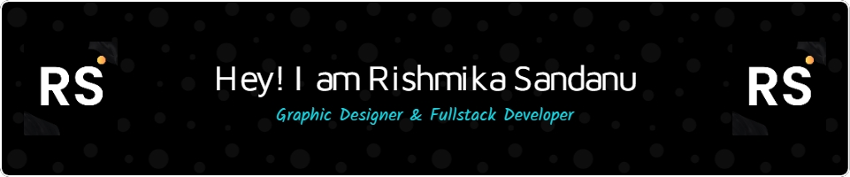

  <h1>😊 About Me</h1>

  - 🚶‍ I live in: Sri Lanka 🇱🇰
  - 🔭 I’m currently working on: **Adobe Photoshop**
  - 👯 I’m looking to collaborate on: **GitHub**
  - 🤔 I’m looking for help with: **My Projects**
  - 💬 Ask me about: [Here](https://rishbropromax.github.io/)
  - 📫 How to reach me: [Click Here](t.me/AboutRishmika)

  ## 🌐 Socials:
   
  
  
  
  

  # 💻 Tech Stack:
  
  
  
  
  
  
  
  
  
  
  
  
  
  
  
  
  
  
  
  
  
  
  
  
  
  

  ## 📊 My GitHub Stats:
   
  
  
   

   
   

