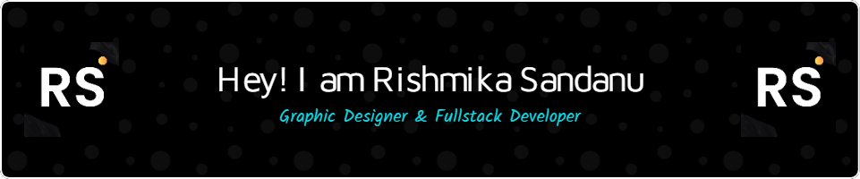

  <h1>😊 About Me</h1>

  - 🚶‍ I live in: Sri Lanka 🇱🇰
  - 🔭 I’m currently working on: **Nextjs*
  - 👯 I’m looking to collaborate on: Notelk.store
  - 🤔 I’m looking for help with: NoteLK.store
  - 💬 Ask me about: [Click Here](https://imrishmika.dev)
  - 📫 How to reach me: [Click Here](https://imrishmika.dev)

  ## 🌐 Socials:
   
  
  
  
  

  ## 📊 My GitHub Stats:
   
  
  
   

   
   

